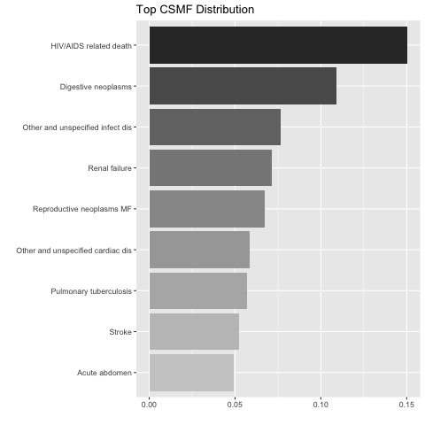

# InterVA5  [](https://travis-ci.org/verbal-autopsy-software/InterVA5) [](https://ci.appveyor.com/project/verbal-autopsy-software/InterVA5) [](https://cran.r-project.org/package=InterVA5) [](https://cran.r-project.org/package=InterVA5) [](https://cran.r-project.org/package=InterVA5)


R version of the 'InterVA5' software (<http://www.byass.uk/interva>) for coding cause of death from verbal autopsies. It also provides simple graphical representation of individual and population level statistics.

This is an R package replicating InterVA-5 software. For stable version of the package please visit http://cran.r-project.org/web/packages/InterVA5/index.html.
R can be downloaded and installed from <https://cran.r-project.org/>.

If you have any questions regarding this package, or have concerns/find bugs/have new ideas in better implementations to share, please contact Richard Li at lizehang@uw.edu. 

## What's new
- [CRAN version](https://cran.r-project.org/web/packages/InterVA5/news.html)
- [Current developer version (1.0.x)](InterVA5_1.0/NEWS.md)

## Getting started
To install the package from CRAN, run the script: 
```r
install.packages("InterVA5")
```

Here is an example session of how to use the InterVA5 with the example data set:
```r
> library(InterVA5)
> data(RandomVA5)

> ## assign caueses
> sample_output <- InterVA5(Input = RandomVA5, HIV = "h", Malaria = "v", write=TRUE,
                            directory = tempdir(), filename = "VA5_result")
Using Probbase version:  probbase v19 20210720
..........10% completed
..........20% completed
..........30% completed
..........40% completed
..........50% completed
..........60% completed
..........70% completed
..........80% completed
..........90% completed
..........100% completed
100% completed

> ## CSMF of top 10 causes
> summary(sample_output, top=10)
InterVA5 fitted on 200 deaths
CSMF calculated using reported causes by InterVA5 only
The remaining probabilities are assigned to 'Undetermined'

Top 10 CSMFs:
 cause                             likelihood
 Undetermined                      0.1398    
 HIV/AIDS related death            0.1391    
 Digestive neoplasms               0.0981    
 Other and unspecified infect dis  0.0685    
 Renal failure                     0.0620    
 Reproductive neoplasms MF         0.0541    
 Other and unspecified cardiac dis 0.0536    
 Pulmonary tuberculosis            0.0496    
 Stroke                            0.0477    
 Acute abdomen                     0.0412    

Top 6 Circumstance of Mortality Category:
 cause      likelihood
 Culture    0.570     
 Knowledge  0.160     
 Inevitable 0.110     
 Multiple   0.110     
 Emergency  0.030     
 Resources  0.015  

## Get CSMF with plot
CSMF5(sample_output)
```


